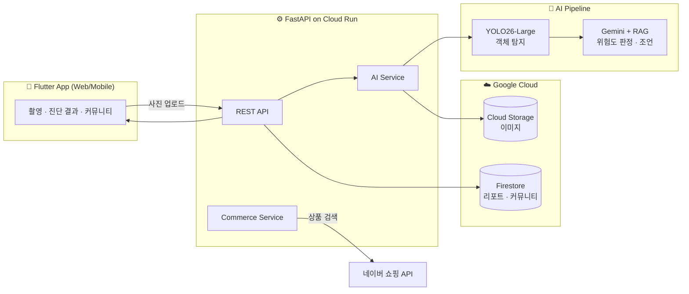
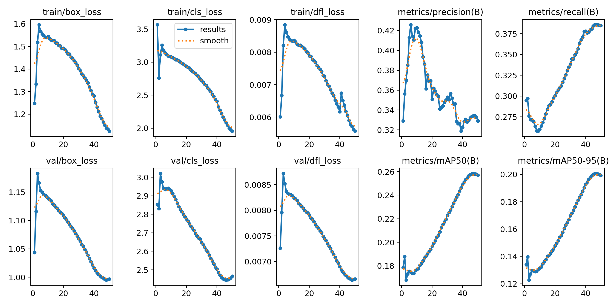
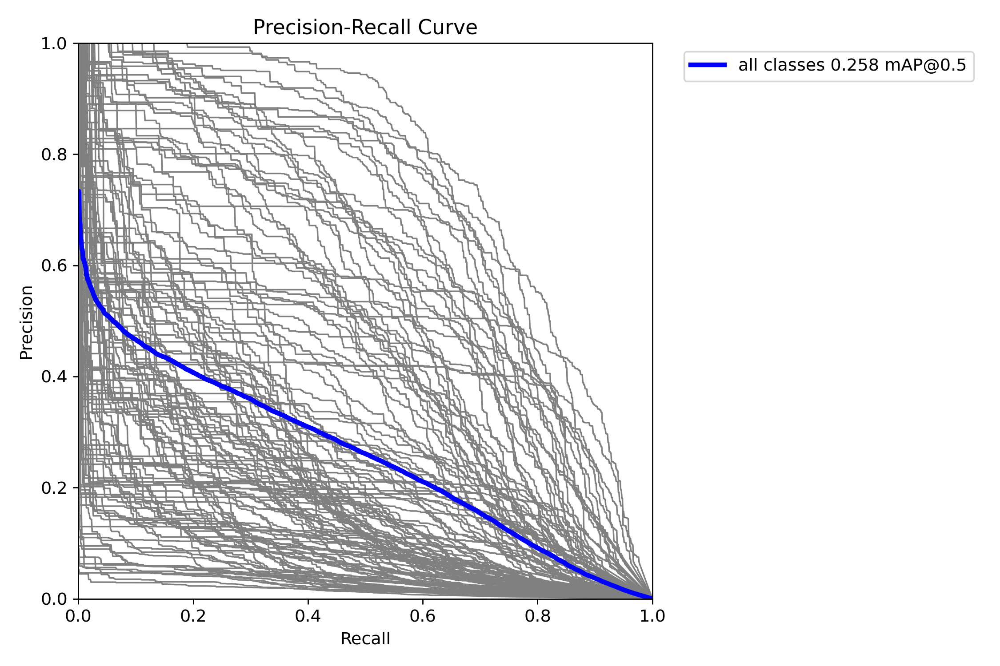
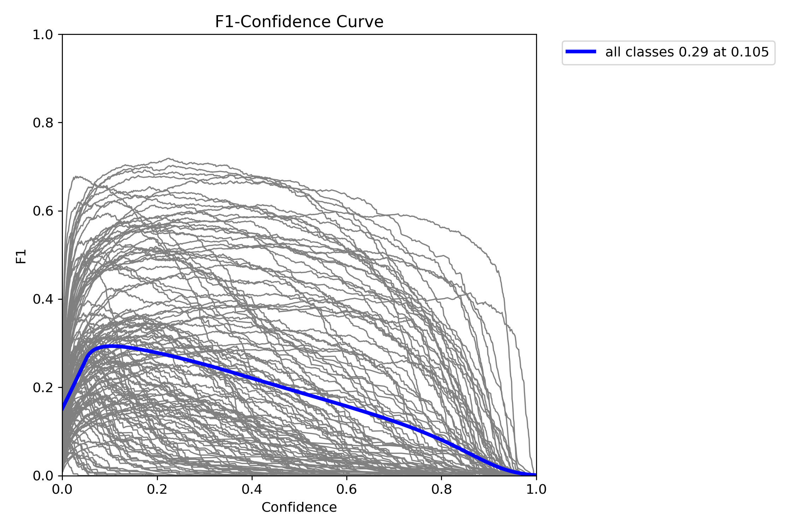

# 🛡️ SafeHomeAI

> **AI 기반 아동 안전 진단 서비스** — 집안 사진 한 장으로 우리 아이에게 위험한 요소를 찾아내고, 발달 단계에 맞춘 안전 가이드와 해결책을 제안합니다.

<p align="left">
  
  
  
  
  
</p>

---

## 📌 프로젝트 개요

영유아 안전사고의 상당수는 가정 내에서, 보호자가 미처 인지하지 못한 환경적 위험요소(질식·추락·감전·중독 등)로 인해 발생합니다. **SafeHomeAI**는 이 문제를 기술로 풀어낸 모바일 서비스입니다.

사용자가 거실·침실·주방 등 공간 사진을 촬영하면,

1. **객체 탐지 AI(YOLO26)** 가 사진 속 사물을 인식하고,
2. **RAG 기반 LLM(Gemini)** 이 아이의 **발달 단계**(누워있는 시기 → 기어다니는 시기 → 걷는 시기)에 맞춰 각 사물의 위험도를 판정하며,
3. 위험요소별 **조치 방법**과 **안전용품 추천(네이버 쇼핑 연동)** 까지 한 번에 제공합니다.

진단 결과는 기록으로 저장되고, 다른 보호자들과 공유·소통할 수 있는 **커뮤니티** 기능까지 갖춘 풀스택 서비스입니다.

> 강원대학교 2025 Google Cloud BootCamp 프로젝트로 진행되었습니다.

---

## 🎥 시연 & 발표 자료

| 자료 | 위치 |
|---|---|
| 🎬 시연 영상 | [`presentation/시연영상.mp4`](presentation/시연영상.mp4) |
| 📊 최종 발표 자료 | [`presentation/최종발표.pdf`](presentation/최종발표.pdf) |

---

## ✨ 핵심 기능

| 구분 | 기능 |
|---|---|
| 🔍 **안전 진단** | 사진 업로드 → 객체 탐지 → 발달 단계별 위험도 판정 → 위험요소 리스트 + 조치 가이드 생성 |
| 🧠 **RAG 안전 가이드** | 국가 안전 가이드라인 기반 지식베이스를 참조해 신뢰도 높은 맞춤형 조언 생성 |
| 👶 **아이 프로필** | 아이별 성장 단계를 등록해, 같은 사물도 발달 단계에 맞게 차등 진단 |
| 🛒 **안전용품 추천** | 위험요소 해결에 필요한 제품을 네이버 쇼핑 API로 검색·추천 |
| 📂 **진단 히스토리** | 분석 리포트 저장·조회·삭제, 위험요소 해결(resolve) 체크 |
| 👥 **커뮤니티** | 진단 결과 공유, 게시글/댓글/좋아요, 일간 베스트 |
| 🔐 **인증** | JWT 기반 회원가입/로그인 + 게스트 로그인 |

---

## 🏗️ 시스템 아키텍처



요청 흐름: **사진 업로드 → YOLO 객체 탐지 → 위험 매핑(risk_map) → Gemini RAG 조언 생성 → GCS 이미지 저장 + Firestore 리포트 저장 → 결과 반환**

---

## 🧠 AI 모델 상세

객체 탐지 모델은 직접 학습시켰습니다.

| 항목 | 내용 |
|---|---|
| **베이스 모델** | YOLO26-Large (MuSGD 옵티마이저) |
| **학습 데이터** | Objects365 기반 600K 이미지 / 128 클래스 (가정 내 사물 중심으로 재구성) |
| **학습 환경** | GCP A100 40GB Multi-GPU (DDP) |
| **하이퍼파라미터** | 50 epochs · imgsz 640 · batch 128 · Cosine LR(lr0=0.01) · AMP |
| **데이터 전처리** | 라벨 정제·클래스 재매핑·중복 제거·train/val 분할 스크립트 직접 작성 (`DataPreProcessing/`) |

**RAG 구조**: 탐지된 객체를 `risk_map.txt`(발달 단계별 위험 객체 매핑 규칙)와 `safety_knowledge.txt`(안전 지식베이스)에 대조하여, LLM이 근거 기반으로 위험도(🚨 위험 / ⚠️ 경고)와 조치 방법을 생성합니다. 단순 LLM 호출 대비 **환각(hallucination)을 줄이고 안전 정보의 신뢰성**을 확보한 것이 핵심입니다.

### 📈 학습 결과

학습 전 과정의 손실(Loss)과 지표(Precision·Recall·mAP) 추이입니다.



| Precision–Recall Curve | F1–Confidence Curve |
|:---:|:---:|
|  |  |

> 전체 지표 원본은 [`models/final_model/`](models/final_model/)에서 확인할 수 있습니다.

---

## 🛠️ 기술 스택

| 영역 | 기술 |
|---|---|
| **AI / ML** | YOLO26 (Ultralytics), Google Gemini, RAG |
| **Backend** | Python, FastAPI, Uvicorn, JWT 인증 |
| **Frontend** | Flutter (Dart), Provider(상태관리), `image_picker` / `camera` |
| **Database** | Google Firestore |
| **Storage** | Google Cloud Storage |
| **Infra / Deploy** | GCP Cloud Run, Docker, Firebase Hosting |
| **External API** | 네이버 쇼핑 검색 API |

---

## 📂 폴더 구조

```
SafeHomeAI/
├── backend/                # FastAPI 서버
│   └── app/
│       ├── api/            # API 엔드포인트
│       ├── services/       # AI 분석 · GCS · 커머스 비즈니스 로직
│       ├── db/             # Firestore 연동
│       ├── core/           # 설정 · 보안(JWT)
│       └── data/           # RAG 지식베이스 (risk_map, safety_knowledge)
├── frontend/               # Flutter 앱 (screens / widgets / providers / models)
├── models/                 # YOLO 학습 스크립트 · 결과 지표 · 가중치
├── DataPreProcessing/      # 데이터셋 전처리 스크립트
└── presentation/           # 발표자료 · 시연영상
```

---

## 👤 담당 역할

본 프로젝트에서 **AI 모델링을 중심으로, 모델을 실제 서비스로 연결하는 백엔드·프론트엔드 작업까지** 폭넓게 참여했습니다.

- **AI / 모델링 (핵심)**
  - YOLO26-Large 객체 탐지 모델 학습 및 하이퍼파라미터 튜닝 (GCP A100 멀티 GPU 환경)
  - 가정 내 사물 중심 데이터셋 전처리 파이프라인 구축 (라벨 정제 · 클래스 재매핑 · 분할)
  - 발달 단계별 위험 매핑 규칙(`risk_map`)과 Gemini 기반 RAG 조언 생성 로직 설계
- **백엔드**
  - FastAPI 기반 분석/인증/히스토리/커뮤니티 API 구현, AI 파이프라인 서비스 연동
  - GCP Cloud Run 배포, GCS·Firestore 연동
- **프론트엔드**
  - Flutter 앱에서 촬영–진단–결과–해결책 흐름 및 화면 구현, 백엔드 API 연동

---

## 🚀 실행 방법

### Backend
```bash
cd backend
pip install -r requirements.txt
# 환경변수(GEMINI_API_KEY 등)와 GCP 인증(key.json 또는 ADC) 설정 필요
uvicorn app.main:app --reload
```

### Frontend
```bash
cd frontend
flutter pub get
flutter run -d chrome
```

> ⚙️ Cloud Run 배포 및 Firebase Hosting 배포 절차는 `backend/README.md`, `frontend/README.md` 참고.

---

<p align="center">
  <i>Made with care for children's safety 👶</i>
</p>
